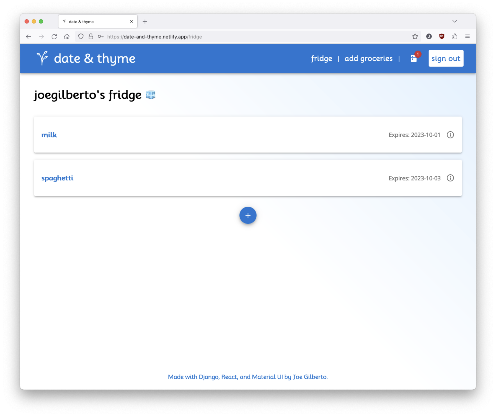

# date-and-thyme
A full-stack Django/React web application that keeps track of when food in your fridge is best by.  Utilizes a React frontend with Material UI and Axios API calls deployed on Netlify, and a Django backend deployed on Heroku that interacts with a PostgreSQL database through the Django REST Framework.  Built by [Joe Gilberto](https://joekgilberto.com/).

## Deployment
Find the app deployed on Netlify, here: [https://date-and-thyme.netlify.app/](https://date-and-thyme.netlify.app/)

## Screenshots

### Home

As a user, I want to land on a well styiled home page when I visit the application.

### Sign In

As a user, I want to sign in to acces personalized data.

### Sign Up

As a user, I want to sign in to acces personalized data.

### Home (Signed In)

As a user, once signed in I want to access a personalized homepage.

### Fridge

As a user, I want to be able to access my fridge with groceries who's expiration dates are being tracked.

### Notifications

As a user, I want to be able to see relevant notifications about the expiration status of my groceries.

### Notifications

As a user, I want to be able to add grocereis to my fridge to be tracked.

## Technologies Used

For the frontend, I utlized [React](https://react.dev/) components combined with [Material UI](https://mui.com/material-ui/) for styling and [Axios](https://axios-http.com/) to make API calls to my backend.  My backend was built using [Django](https://www.djangoproject.com/) and interacting with [PostgreSQL](https://www.postgresql.org/), while employing the [Django REST Framework](https://www.django-rest-framework.org/), to make RESTful API routes.  User's are authenticated by signing in with [Django Token Authentication](https://www.django-rest-framework.org/api-guide/authentication/).

### Resources
Below are specific relevant resources I referenced while building this application.

- [A public domain plant icon from Wikimedia](https://commons.wikimedia.org/wiki/File:Plant_(67683)_-_The_Noun_Project.svg) that I used as the favicon and header logo
- [A Django REST Framework authetnication guide from the Django REST Framework documentation](https://www.django-rest-framework.org/api-guide/authentication/#tokenauthentication), that I specifically used the secition on TokenAuthentication
- [An article, "How to Implement Token Authentication using Django REST Framework"](https://simpleisbetterthancomplex.com/tutorial/2018/11/22/how-to-implement-token-authentication-using-django-rest-framework.html#implementing-the-token-authentication), that helped me implement authentication upon getting a token for authentication (from the above resource, A Django REST Framework authetnication guide).
- [A Django REST Framework tutorial for authentication and permissions from the Django REST Framework documentation](https://www.django-rest-framework.org/tutorial/4-authentication-and-permissions/), that I used to set permissions for CRUD operations.
- [A Stack Overflow thread that discusses posting a password to the Django User model](https://stackoverflow.com/questions/56701988/how-to-fix-invalid-password-format-or-unknown-hashing-algorithm-in-a-custom-u), that I used to allow users from the frontend to sign up without admin support.

## Instructions for Local Deployment
The following instructions were used through macOS with a silicone M1 chip.

### Fork and clone
To deploy locally, fork and clone this repo.  Then, using the terminal, navigate into the backend directory.

### Set up a virtual environment to run Python
Once in the backend, you will have to set up a virtual environment through the following commands.

First, install virtualenv:
```
pip3 install virtualenv
```
Then create a virtual environment:
```
 python3 -m venv myenv
```
Enter the virtual environment:
```
 source myenv/bin/activate
```

### Install backend dependencies
Next, install backend dependencies by running:
```
pip install -r requirements.txt
```

### Create a local database
Then, create a local PostgreSQL database.
```
createdb date_and_thyme 
```

### Create backend environmental variables
Still in the backend directory, create an env file:
```
touch backend/.env
```
Within that .env file, add the SECRET_KEY vairable of your choosing and a WHITELIST variable to allow the frontend React app (running on localhost:3000) to interact with the Django backend:
```
SECRET_KEY='<your key>'
WHITELIST='http://localhost:3000'
```

### Spin up backend server
For the final step of your backend set up, spin up the server with the following command:
```
 python3 manage.py runserver
```

### Install frontend dependencies
For the first step of your frontend set up, navigate into your frontend directory via your terminal and install your dependencies.
```
npm i
```

### Create frontend environmental variables
Next, create your environmental variables:
```
touch .env.local
```
Then, add your database environmental variables to interact with your backend (running on localhost:8000):
```
REACT_APP_FOOD_API_URL=http://localhost:8000/food-items/
REACT_APP_NOTIF_API_URL=http://localhost:8000/notifications/
REACT_APP_AUTH_API_URL=http://localhost:8000/api-token-auth/
REACT_APP_USER_API_URL=http://localhost:8000/user/
```

### Spin up your frontend server
Finally, while still in your frontend directory, spin up your front server:
```
npm start
```

### Browse
Now, you can go to localhost:3000 in your browser (Google Chrome is reccommended for best performance) and browse the application.

## Current User Flow
Firstly, visit [https://date-and-thyme.netlify.app/](https://date-and-thyme.netlify.app/)

From the home page, the user can read up on the application.  The user can then sign in (through the button on the homepage or header) to access the application.  Once on the authorization page, a returning user can sign in and a new user can sign up.  If a returning user were to attempt to sign up with the same credentials, they would be automatically logged in.  After logging in, users can navigate the site throuhg the header's nav.  Through "Add Groceries" they can add food items and their expiration date to their fridge.  The user can check what items are in the fridge through the "Fridge" navigation link, and can click on those items to view further details, edit those details, or delete the grocery item.  Then, through the fridge icon in the navigation, users can see what notifications they have (reminding them when food has 5 or less days, warning them when food has 2 or less days, and alerting them when the food has expired).  The notifications will update every time the user opens the app.

## Future Features
Features to be added in further edits:
- The ability to track what food is eaten, what food is discarded after expiration, and which items are neutrally deleted.
- Users will receive email and/or text notifications when food is about to go bad
- When viewing a grocery item's detail page, the OpenAI API will generate and return one recipe with said grocery item.
