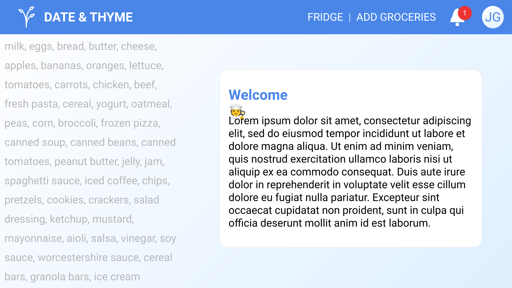
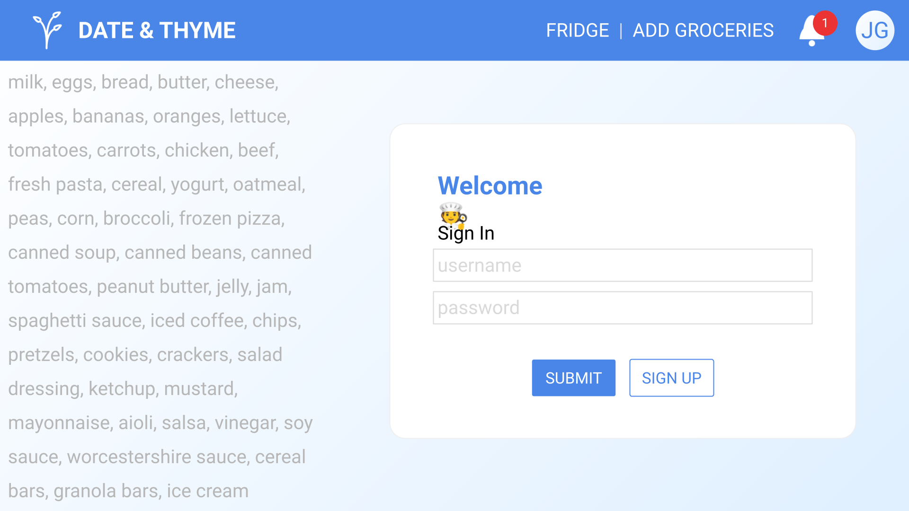
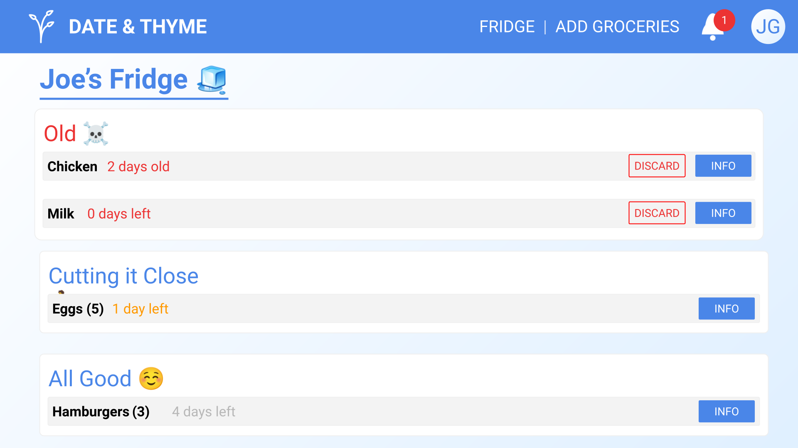
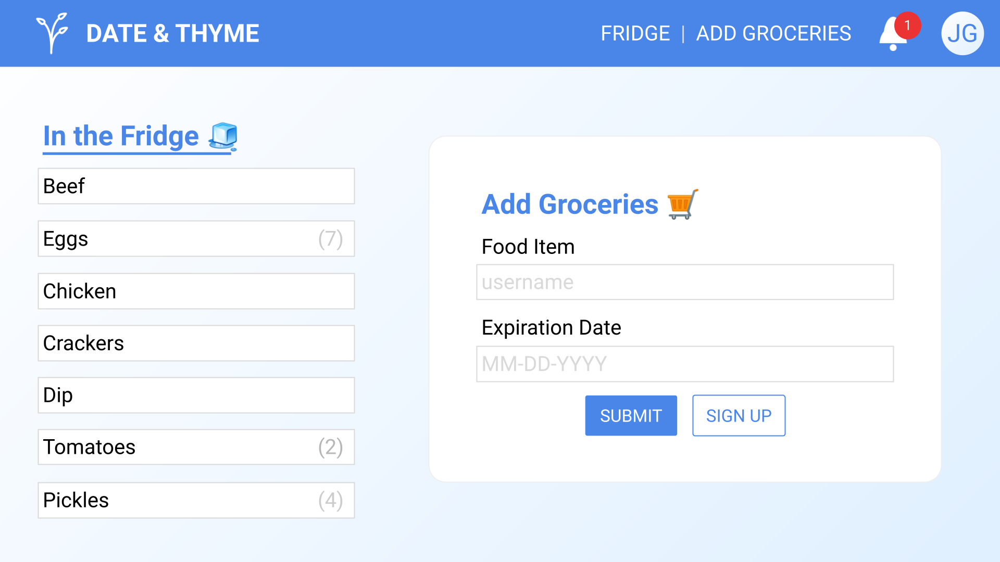
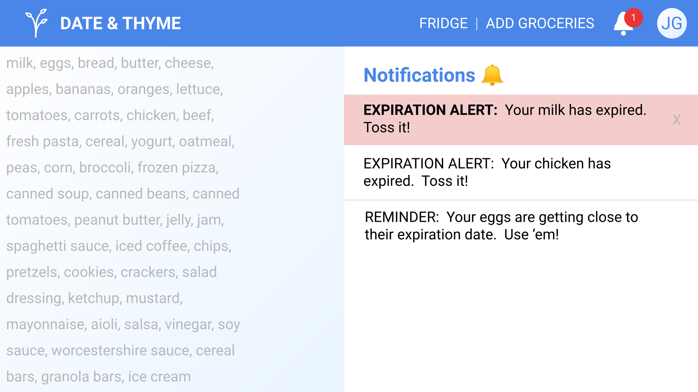
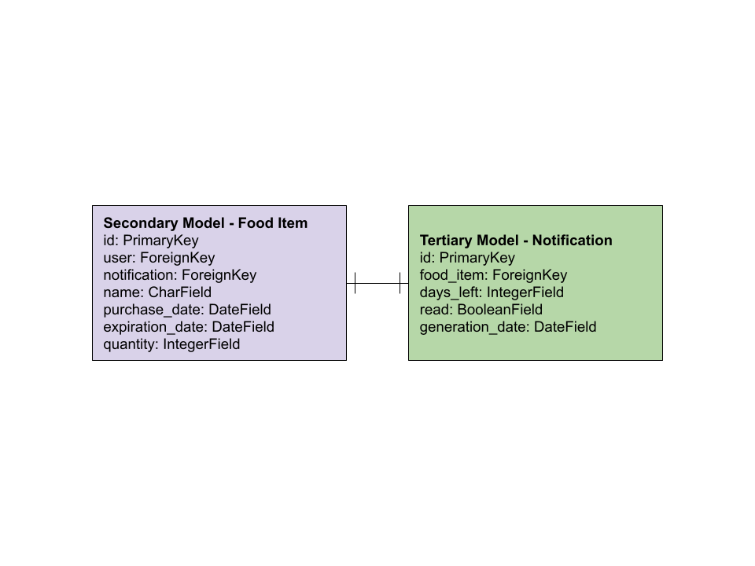
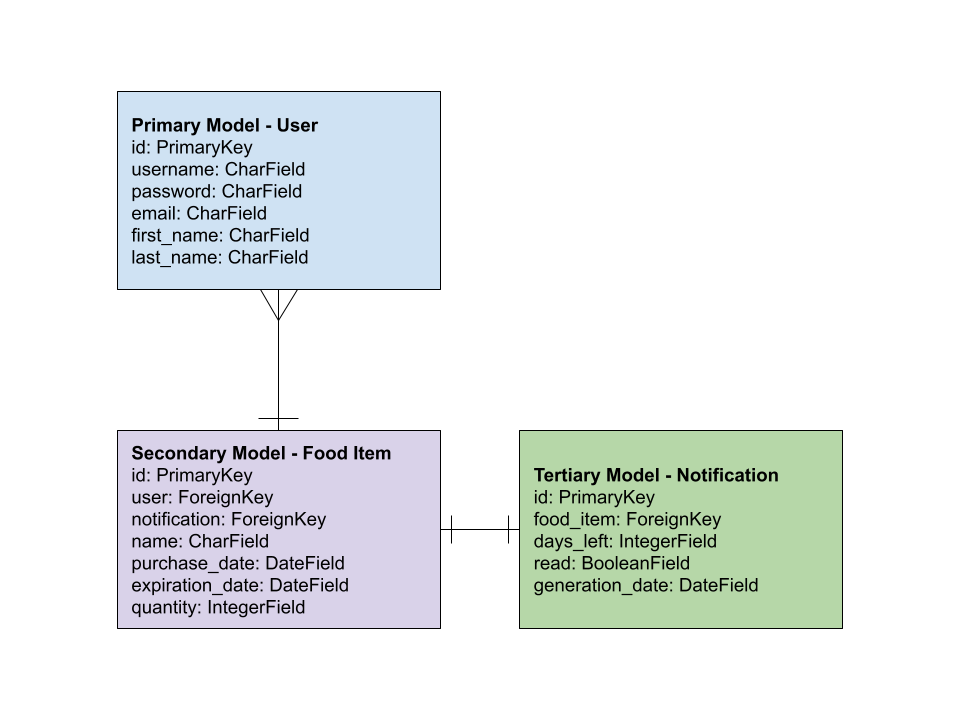
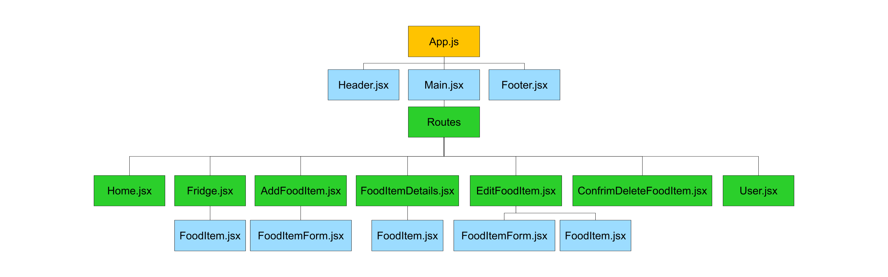
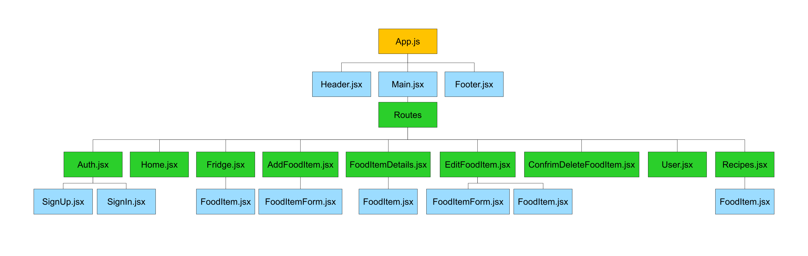

# Date & Thyme

## Project Summary
A full-stack application that allows users to login, add food items and their expiration dates to their virtual fridge, and get notifications when those food items are about to expire.  It will be built with a React frontend with Material UI components, a Django backend and authentication.  The front and backends will be deployed on Netlify and Heroku respectfully.

## Trello
[Found here](https://trello.com/b/56bhwQbq/project-4-date-and-thyme)

## Wireframes
### Home

### Auth

### Fridge

### Add Food Item

### Notfications Feed

## Models
### Primary Model - User
|**Property**|**DataType**|
| - | - |
| id | PrimaryKey |
| username | string |
| password | string |
| email | String |
| first_name | String |
| last_name | String |
| fridge | ForeignKey |

### Secondary Model - Fridge
|**Property**|**DataType**|
| - | - |
| id | PrimaryKey |
| user | ForeignKey |
| food_items | List |
| notifications | List |

### Tertiary Model - Food Item
|**Property**|**DataType**|
| - | - |
| id | PrimaryKey |
| fridge | ForeignKey |
| purchase_date | Date |
| expiration_date | Date |
| quantity | Integer |

### Quaternary Model - Notification
|**Property**|**DataType**|
| - | - |
| id | PrimaryKey |
| fridge | ForeignKey |
| description | List |
| read | Boolean |

## ERD
### MVP

### Icebox

## Component Tree
### MVP

### Icebox

## User Stories
### MVP
- As a user, I want to be able to access a fridge list with all of my food items and their expiration dates displayed.
- As a user, I want to be able to add food items and their expiration dates to the fridge.
- As a user, I want to be able to delete a food item if I eat or discard it.
- As a user, I want to be able to edit food item data in case I entered something incorrectly.
- As  user, I want my fridge to be ordered by soonest expiration date so I know what's going to expire the soonest.
- As a user, I want to get notifications when my food is expired so I know what food I should discard.
- As a user, I want to get notifications when my food is about to expire so I know what food I should use.
- As a user, I want to be able to mark notifications as read.

### Icebox
- As a user, I want to be able to record how much food I discard- as opposed to delete- to keep track of how much food I waste.
- As a user, I want to be able to record how much food I eat- as opposed to delete or discard- to keep track of how much food I don't waste.
- As a user, I want to be able to sign up for the application to keep personalized data.
- As a user, I want to be able to login to access personalized data.
- As a user, when I open a food item's details page, I want OpenAI's API to suggest recipes.